# MON 常用工具推荐

[简体中文](README.md) | [English](README.en.md)

[下载图文 PDF](output/pdf/MON-Tool-Recommendations.pdf)

> 配图截取自对应软件的官方网站或官方 GitHub 页面，仅用于展示软件界面与产品特点。

这里整理了我日常使用并愿意推荐的软件工具。清单只分为四个大类，每款工具都附有介绍、主要功能、优点和官方入口；开源项目还会列出 GitHub 仓库。

> 请从官方网站或项目仓库下载软件。网络代理、内网穿透、下载和流媒体工具应在当地法律、服务条款与内容授权允许的范围内使用。

## 目录

- [录屏、创作与文档](#录屏创作与文档)
- [系统、效率与开发](#系统效率与开发)
- [下载与网络](#下载与网络)
- [影音与娱乐](#影音与娱乐)

## 录屏、创作与文档

### OBS Studio

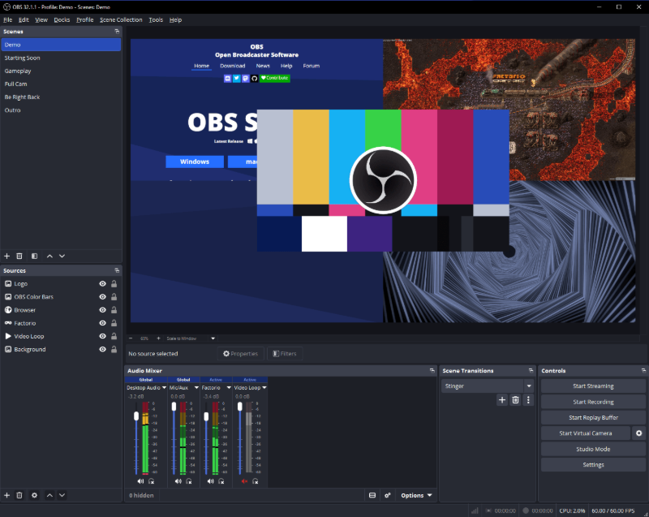

OBS Studio 是一款免费、开源、跨平台的录屏与直播软件，适合游戏直播、课程录制、会议演示和多机位内容制作。

- **功能：** 场景与来源组合、窗口/屏幕/游戏采集、摄像头与音频混流、直播、本地录制、滤镜、转场和插件扩展。
- **优点：** 免费无水印；配置自由度高；支持 Windows、macOS 和 Linux；社区与插件生态成熟。
- **官网：** [obsproject.com](https://obsproject.com/)
- **GitHub：** [obsproject/obs-studio](https://github.com/obsproject/obs-studio)

### Bandicam

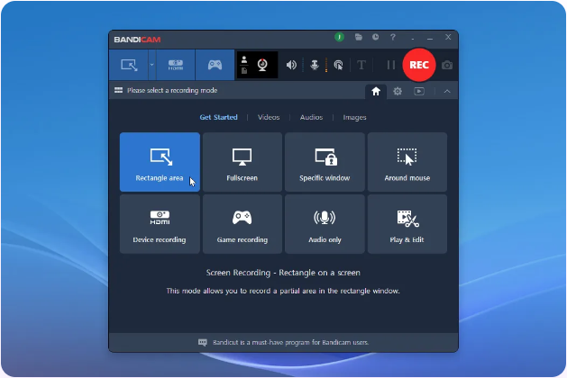

Bandicam 是偏重 Windows 游戏和桌面录制的商业录屏工具，适合希望快速得到高质量成片的用户。

- **功能：** 屏幕区域、游戏、摄像头和外接设备录制，麦克风混音、实时绘制、鼠标效果、定时录制和截图。
- **优点：** 上手门槛低；硬件编码支持完善；录制时即可压缩视频，能较好地兼顾画质、性能和文件体积。
- **官网：** [bandicam.com](https://www.bandicam.com/)

### Typora

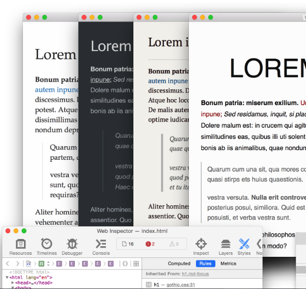

Typora 是一款专注写作体验的 Markdown 编辑器，用单窗口实时渲染代替传统的“源码 + 预览”双栏界面。

- **功能：** Markdown 实时预览、表格、代码块、数学公式、Mermaid 图表、大纲、文件树、主题以及多格式导出。
- **优点：** 界面干净、所见即所得；中文排版体验好；复杂 Markdown 元素编辑直观。
- **官网：** [typora.io](https://typora.io/)

### 福昕 PDF 阅读器（Foxit PDF Reader）

福昕 PDF 阅读器是一款跨平台 PDF 阅读与批注工具，适合日常阅读、审阅、填写表单和签署文档。

- **功能：** 阅读与打印、文本批注、表单填写、手写或数字签名、文件分享，以及部分 AI 摘要、翻译和问答能力。
- **优点：** 打开和渲染速度快；功能比基础阅读器完整；Office 风格界面容易上手；支持桌面、移动和网页端。
- **官网：** [foxit.com/pdf-reader](https://www.foxit.com/pdf-reader/)

### Arctime

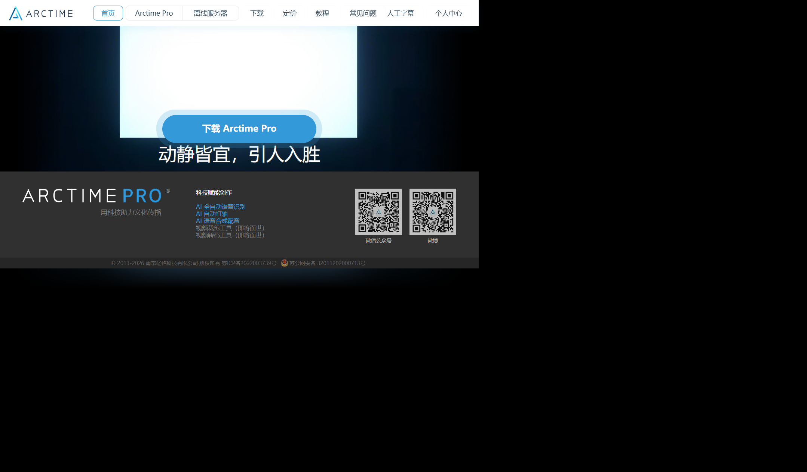

Arctime 是面向视频创作者的跨平台字幕制作软件，重点解决听写、打轴、样式设计和字幕压制。

- **功能：** 音视频波形打轴、字幕编辑与校对、AI 语音识别、自动打轴、字幕样式设计、翻译辅助和视频压制。
- **优点：** 时间轴操作直观；字幕制作流程集中；对中文视频工作流友好；支持 Windows、macOS 和 Linux。
- **官网：** [arctime.cn](https://arctime.cn/)

## 系统、效率与开发

### Geek Uninstaller

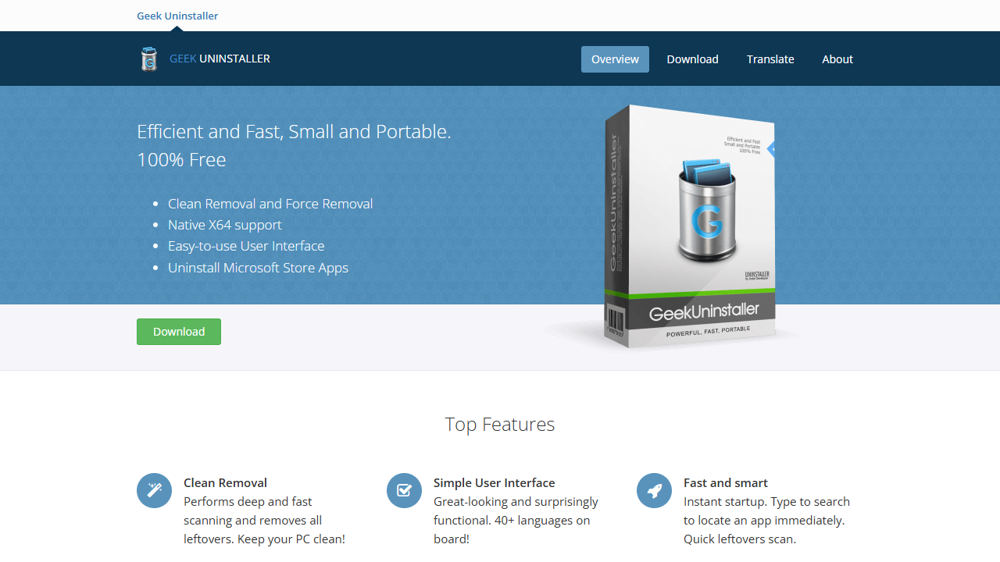

Geek Uninstaller 是一款轻量的 Windows 软件卸载工具，主要用于移除普通程序、商店应用和残留项目。

- **功能：** 常规卸载、残留扫描、强制删除损坏的卸载项、注册表/安装目录定位和软件列表导出。
- **优点：** 单文件便携、无需安装；启动和扫描速度快；比系统自带入口更方便处理残留和异常条目。
- **官网：** [geekuninstaller.com](https://geekuninstaller.com/)

### DeskBox

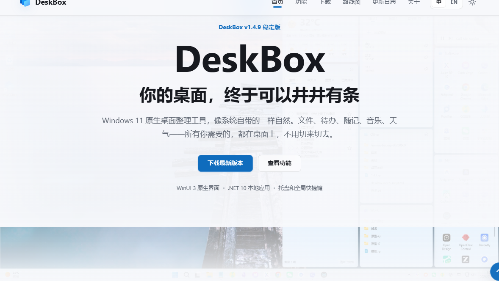

DeskBox 是一款免费、开源的 Windows 桌面整理工具，用原生风格小组件管理真实文件夹和常用信息。

- **功能：** 桌面文件分区与自动整理、文件夹映射、文件堆叠、待办事项、快速笔记、搜索、天气和音乐控制。
- **优点：** 文件仍保存在普通文件夹中；WinUI 3 界面与 Windows 风格协调；本地优先；支持 x64 与 ARM64。
- **官网：** [deskbox.fun](https://deskbox.fun/)
- **GitHub：** [Tianyu199509/DeskBox](https://github.com/Tianyu199509/DeskBox)

### Escrcpy

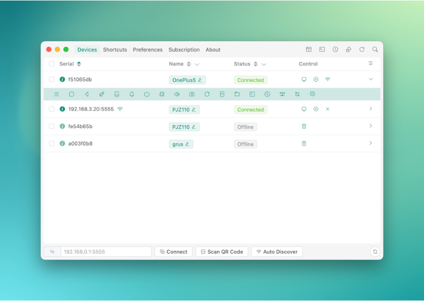

Escrcpy 是基于 scrcpy 的图形化 Android 设备管理工具，让用户通过电脑显示并控制手机。

- **功能：** USB 或无线 ADB 连接、低延迟投屏与控制、录屏和截图、多设备管理、文件/APK 操作、按键映射和自动化。
- **优点：** 将 scrcpy 的高性能能力包装成直观界面；跨平台；无需 Root；适合演示、测试和多设备管理。
- **官网：** [项目主页](https://github.com/viarotel-org/escrcpy)
- **GitHub：** [viarotel-org/escrcpy](https://github.com/viarotel-org/escrcpy)

### Everything

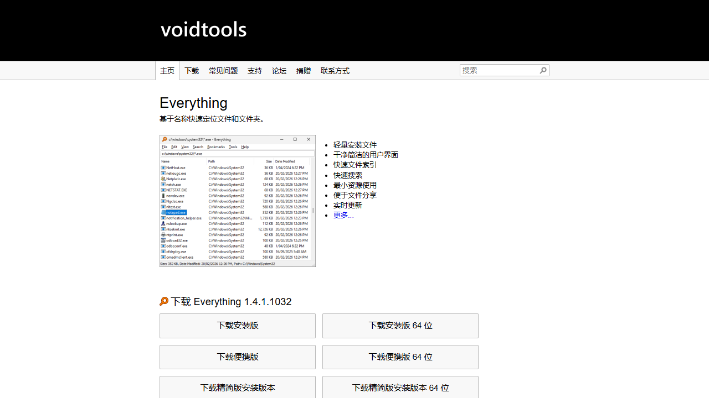

Everything 是 Windows 本地文件名搜索工具，通过快速建立索引实现近乎即时的文件和文件夹查找。

- **功能：** 文件名实时搜索、过滤与排序、高级搜索语法、正则表达式、书签和结果导出。
- **优点：** 索引建立快；搜索响应几乎即时；安装包小、资源占用低；很适合文件数量庞大的磁盘。
- **官网：** [voidtools.com](https://www.voidtools.com/)

### PowerToys

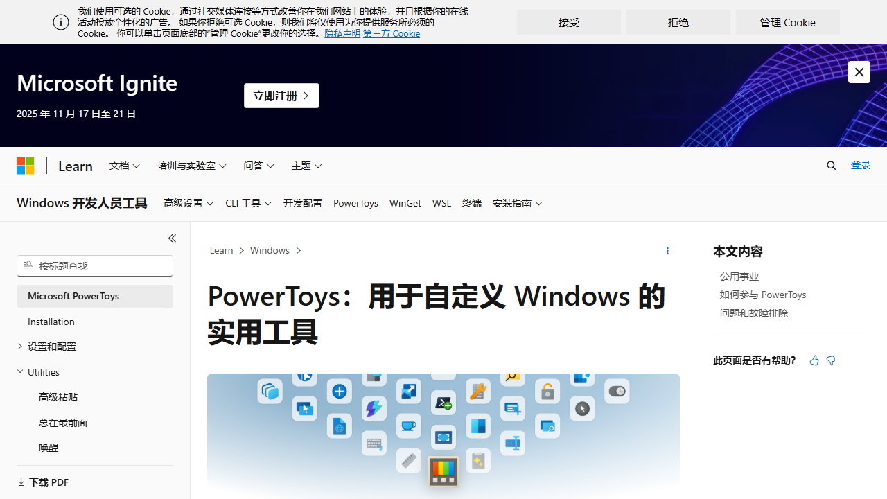

Microsoft PowerToys 是微软维护的开源 Windows 增强工具合集，为系统补充大量效率功能。

- **功能：** FancyZones 窗口布局、快速启动、键盘映射、批量重命名、颜色拾取、文字提取、图片缩放和窗口置顶等。
- **优点：** 一个应用覆盖许多高频小需求；与 Windows 集成自然；模块可单独开关；由微软和社区持续维护。
- **官网：** [Microsoft Learn：PowerToys](https://learn.microsoft.com/windows/powertoys/)
- **GitHub：** [microsoft/PowerToys](https://github.com/microsoft/PowerToys)

### WizTree

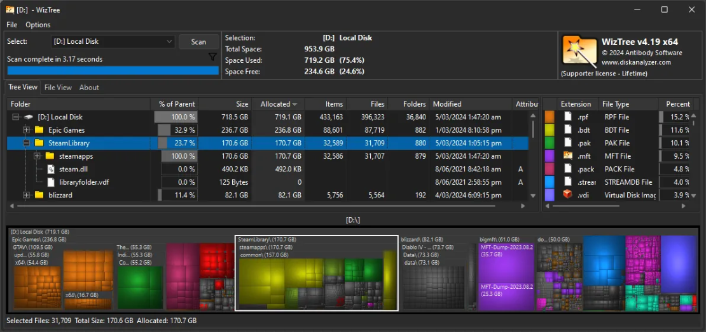

WizTree 是 Windows 磁盘空间分析器，可以快速找出占用空间最大的文件和目录。

- **功能：** 目录树和矩形树图、大小/数量排序、文件类型统计、搜索过滤、结果导出和清理辅助。
- **优点：** 扫描 NTFS 磁盘非常快；空间占用一目了然；有便携版；适合清理磁盘前快速定位大文件。
- **官网：** [diskanalyzer.com](https://diskanalyzer.com/)

### 火绒安全软件

火绒安全软件是一款面向 Windows 的终端安全工具，提供恶意程序防护、网络防护和实用系统工具。

- **功能：** 病毒与木马查杀、实时防护、网络防火墙、漏洞修复、启动项管理、垃圾清理和弹窗拦截。
- **优点：** 界面清爽；日常运行相对安静；安全防护与常用系统管理能力集中；规则选项较丰富。
- **官网：** [huorong.cn](https://www.huorong.cn/)

### DeepSeek Harness

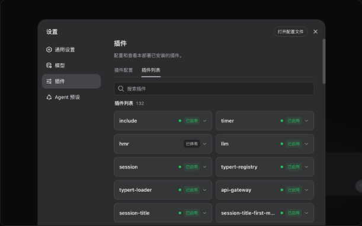

DeepSeek Harness 是 DeepSeek 推出的本地优先、可扩展的开源 AI 编程智能体与 Agent 运行环境，目前处于开发者预览阶段。

- **功能：** 代码读写、Shell 与工具调用、网页检索、技能、子智能体、沙箱、会话追踪和插件化能力组合。
- **优点：** “一切皆插件”的架构便于替换和扩展；运行轨迹可记录、恢复、分叉与回放；支持多种运行模式。
- **官网：** [deepseek.com/harness](https://www.deepseek.com/harness/)
- **GitHub：** [deepseek-ai/deepseek-harness](https://github.com/deepseek-ai/deepseek-harness)

## 下载与网络

### Clash Verge Rev

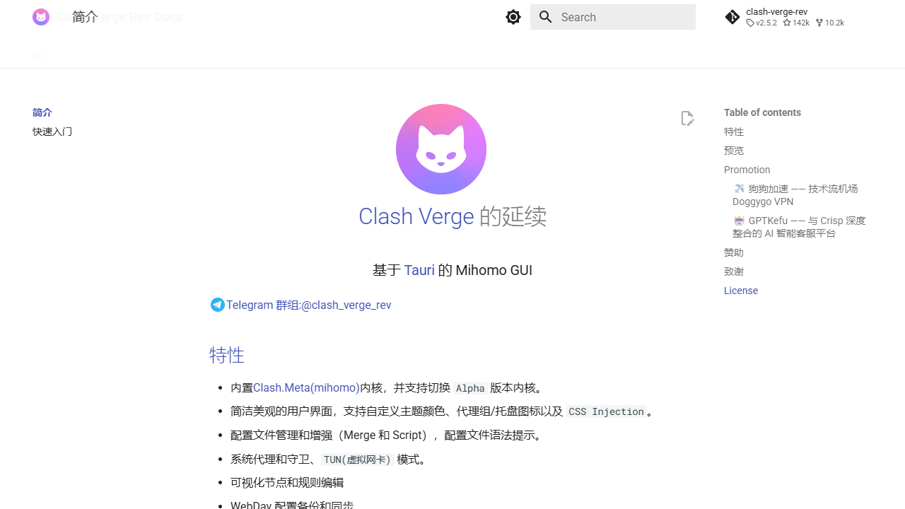

Clash Verge Rev 是基于 Mihomo 内核和 Tauri 的开源跨平台代理客户端，是原 Clash Verge 的社区延续版本。

- **功能：** 订阅与配置管理、系统代理、TUN 模式、节点/规则编辑、配置合并与脚本增强、WebDAV 备份同步。
- **优点：** 支持 Windows、macOS 和 Linux；界面清晰；配置能力丰富；内置 Mihomo 并持续跟进社区功能。
- **官网：** [clashverge.dev](https://www.clashverge.dev/)
- **GitHub：** [clash-verge-rev/clash-verge-rev](https://github.com/clash-verge-rev/clash-verge-rev)

### Neat Download Manager

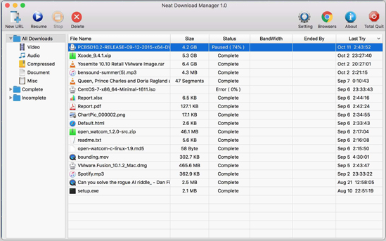

Neat Download Manager 是面向 Windows 与 macOS 的免费下载管理器，强调轻量、多线程和浏览器接管。

- **功能：** HTTP/HTTPS/FTP 下载、动态分段、暂停和断点续传、分类、限速、代理、浏览器扩展和 HLS 合并。
- **优点：** 安装包小；界面简洁；免费且跨平台；能利用可用带宽，并可恢复因断网或崩溃中断的任务。
- **官网：** [neatdownloadmanager.com](https://neatdownloadmanager.com/)

### Internet Download Manager

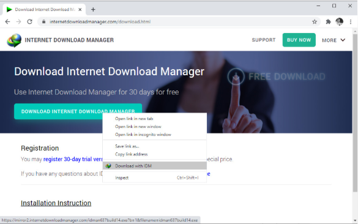

Internet Download Manager（IDM）是 Windows 上成熟的商业下载管理器，以浏览器集成和稳定的分段下载著称。

- **功能：** 浏览器下载接管、动态文件分段、断点续传、批量任务、站点抓取、下载队列、计划任务和限速。
- **优点：** 浏览器兼容范围广；中断恢复能力强；队列和定时功能完整；各种下载场景的兼容性较好。
- **官网：** [internetdownloadmanager.com](https://www.internetdownloadmanager.com/)

### qBittorrent

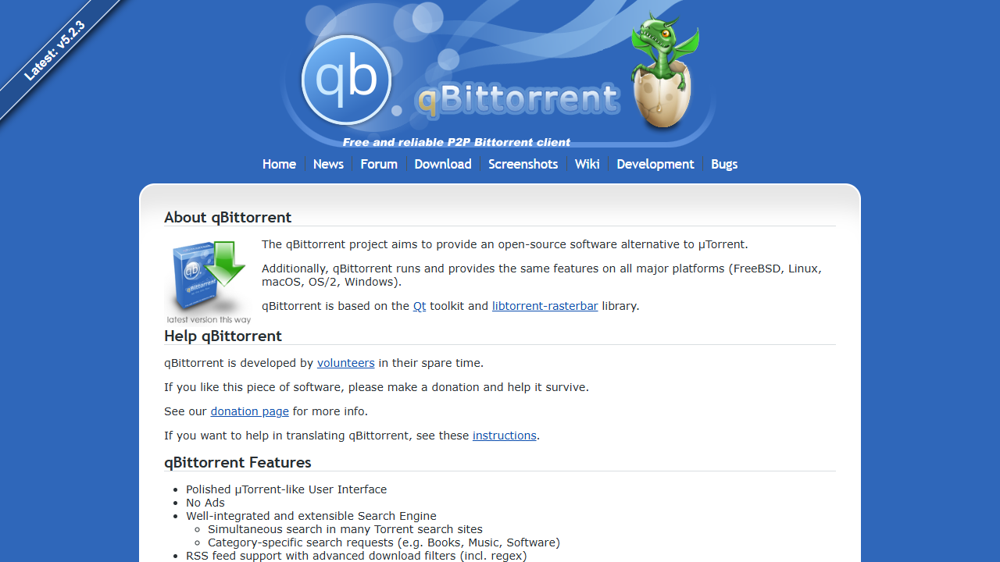

qBittorrent 是一款免费、开源、无广告的 BitTorrent 客户端，提供完整且跨平台的下载体验。

- **功能：** Torrent 与磁力链接、DHT/PEX/LSD、RSS 自动下载、带宽计划、优先级、搜索、种子制作和 Web UI。
- **优点：** 免费无广告；主要桌面平台体验一致；资源占用合理；高级网络和任务控制选项齐全。
- **官网：** [qbittorrent.org](https://www.qbittorrent.org/)
- **GitHub：** [qbittorrent/qBittorrent](https://github.com/qbittorrent/qBittorrent)

### SakuraFrp 启动器

SakuraFrp 启动器是 SakuraFrp 内网穿透服务的客户端，可将内网游戏服务、网站或远程桌面映射到公网节点。

- **功能：** 隧道创建与启停、TCP/UDP/HTTP(S) 转发、开机自启、日志、远程管理和多平台/容器部署。
- **优点：** 中文面板和文档友好；无需公网 IP 即可发布内网服务；节点选择和隧道管理集中。
- **官网：** [natfrp.com](https://www.natfrp.com/)
- **GitHub：** [natfrp](https://github.com/natfrp)（含文档和部分平台项目；Windows 2.x 启动器源码已归档，3.x 核心不再开源）

## 影音与娱乐

### foobar2000

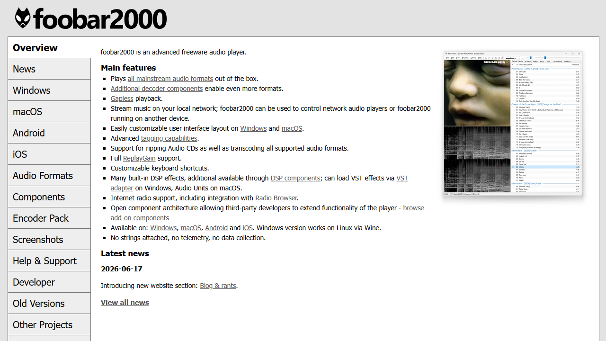

foobar2000 是一款以音频播放、媒体库管理和高度可定制著称的播放器，特别适合本地音乐收藏用户。

- **功能：** 主流音频格式、无缝播放、ReplayGain、标签编辑、CD 抓轨、格式转换、网络电台、DSP 和组件扩展。
- **优点：** 轻量稳定；对大型曲库和元数据管理友好；界面、快捷键和播放链可深度定制；插件生态丰富。
- **官网：** [foobar2000.org](https://www.foobar2000.org/)

### Honeyview

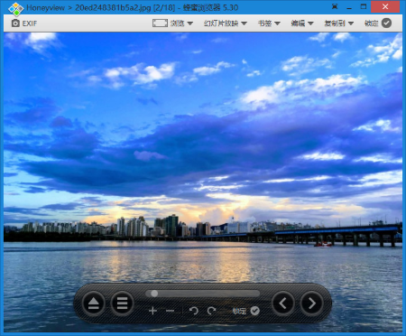

Honeyview 是 Bandisoft 推出的轻量图片浏览器，擅长快速浏览普通图片、动图和压缩包内的漫画图片。

- **功能：** 多格式看图、幻灯片、EXIF/GPS 信息、旋转与缩放、压缩包直接看图和漫画阅读模式。
- **优点：** 启动快、操作简单；无需解压即可连续看图；对漫画和批量图片浏览尤其方便。
- **官网：** [Bandisoft Honeyview](https://www.bandisoft.com/honeyview/)（已结束开发，官方后继产品为 BandiView）

### PotPlayer（64 位）

PotPlayer 是面向 Windows 的多媒体播放器，拥有广泛的格式支持和细致的播放参数设置。

- **功能：** 本地/网络音视频、内置解码器、硬件加速、字幕同步、播放列表、画面与声音处理、截图/录制和 360° 视频。
- **优点：** 格式兼容性强；高分辨率播放效率好；字幕和滤镜调节丰富；既能开箱即用，也能深度配置。
- **官网：** [potplayer.daum.net](https://potplayer.daum.net/)

### Spotify

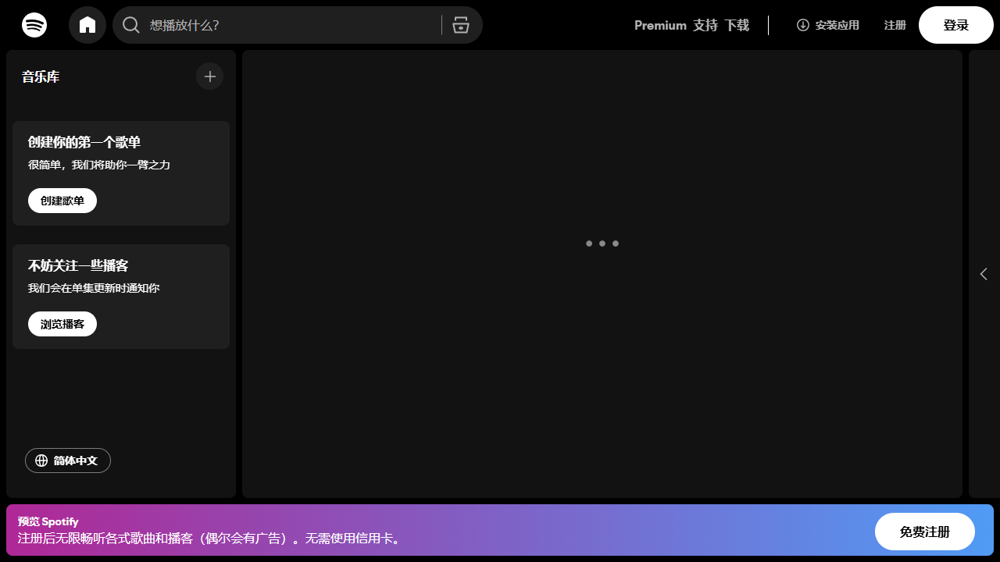

Spotify 是跨平台流媒体音频服务，提供音乐、播客和部分市场的有声书内容。

- **功能：** 在线播放、歌单创建与协作、跨设备同步与控制、个性化推荐、Premium 离线下载和年度回顾。
- **优点：** 曲库覆盖广；推荐和歌单生态成熟；多种设备之间切换方便；社交分享体验完整。
- **官网：** [spotify.com](https://www.spotify.com/)

### Kazumi

Kazumi 是一款基于自定义规则的开源番剧采集与在线观看应用，由用户自行导入规则连接内容来源。

- **功能：** 番剧搜索与时间表、规则分享、多源播放、弹幕、追番、倍速、下载、DLNA 和 Anime4K 超分辨率。
- **优点：** 覆盖 Android、Windows、macOS、Linux 和 iOS；规则灵活；播放器功能完整；社区活跃。
- **官网：** [kazumi.app](https://kazumi.app/)
- **GitHub：** [Predidit/Kazumi](https://github.com/Predidit/Kazumi)

### Lossless Scaling

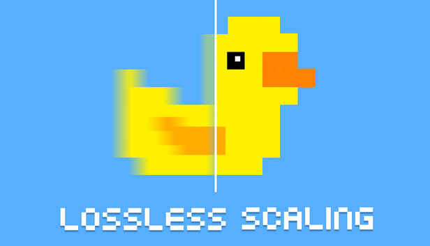

Lossless Scaling 是通过 Steam 提供的 Windows 图像缩放与帧生成工具，可用于缺少原生升频或插帧的游戏和窗口化应用。

- **功能：** LSFG 帧生成、LS1/FSR/NIS 缩放、整数缩放、Anime4K、游戏配置文件、自动触发和双 GPU 卸载。
- **优点：** 对老游戏、模拟器和锁帧游戏兼容性广；不要求游戏原生集成；可灵活平衡画质、负载与流畅度。
- **官网：** [Steam：Lossless Scaling](https://store.steampowered.com/app/993090/Lossless_Scaling/)

## 关于本清单

- 推荐内容基于个人使用场景，软件功能、价格和许可可能随版本变化。
- 开源项目优先给出官方 GitHub 仓库；闭源软件仅给出官方网站。
- 欢迎通过 Issue 或 Pull Request 补充体验、修正链接或推荐其他工具。